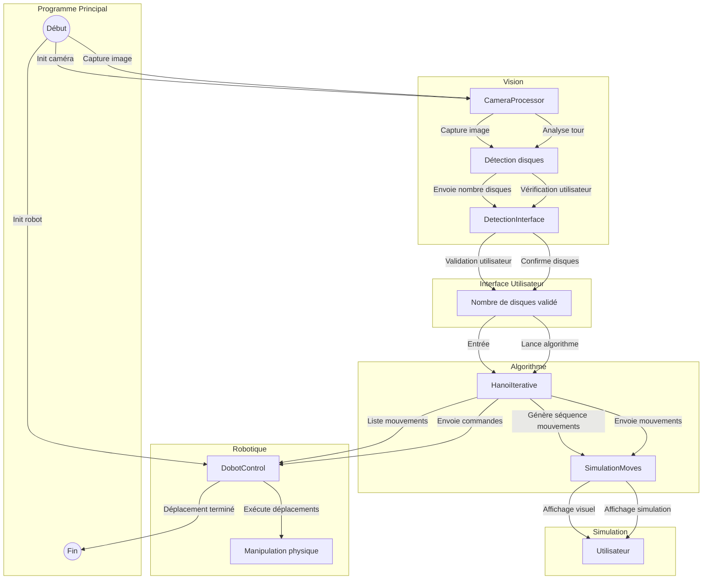

## Introduction

Dans le cadre de notre projet collectif à Polytech Tours, nous avons conçu un programme pour le robot **DOBOT Magician** dans le but de participer aux **journées portes ouvertes** et autres démonstrations. Ce programme permet au robot de **jouer au jeu de la Tour de Hanoï**. Le robot analyse le set placé devant lui et est capable de résoudre le jeu grâce à sa caméra intégrée et à un algorithme adapté.

## Fonctionnalités

* **Déplacement :** Le robot possède des déplacements prédéfinis lui permettant de saisir et déposer les disques aux bons endroits tout au long de la partie.
* **Algorithme :** Un algorithme détermine les prochains mouvements à effectuer, en fonction de l'état du jeu observé en temps réel.
* **Caméra :** Une caméra installée sur la tête du robot permet de visualiser en direct le plateau de jeu.

## Prérequis

### Robot

* Installer le logiciel **DOBOTStudio** pour le contrôle du DOBOT Magician :
 https://www.dobot-robots.com/service/download-center

### Plateau de jeu

* Un plateau physique avec des disques imprimés en 3D.
  **Librairies/modèles 3D :** 

### Caméra

* Une webcam classique suffit pour la détection des disques.
  **Caméra utilisée pour le projet :** Webcam USB avec light

## Algorithme

Nous utilisons un algorithme **itératif** pour résoudre le problème des Tours de Hanoï. Celui-ci calcule une suite d'étapes permettant de déplacer les disques depuis la tour de départ vers la tour d'arrivée en respectant les règles du jeu.

## Installation des librairies

Les libraries sont gére via l'environnement Poetry.

### Installation de Poetry

* **Sur macOS :**

  ```bash
  brew install poetry 
  ```

* **Sur Windows :**
  Téléchargez et exécutez le script via PowerShell :

  ```powershell
  (Invoke-WebRequest -Uri https://install.python-poetry.org -UseBasicParsing).Content | python -
  ```

## Dépendances

### Caméra :

* `opencv-python`
* `numpy`

### Robot :

* `pydobot`
* `pyserial`
* `dearpygui`
* `matplotlib`
* `pillow`
* `scikit-learn`
* `scipy`

### Interface :

* `PyQt6`

## Getting Started

1. **Créer un environnement virtuel ou installer les dépendances :**

```bash
    poetry install
    poetry init
    poetry add requirements.txt
```
1. **Placer les palets avant lancement.**
2. **Placer la caméra sur le bras du robot**
3. **Connecter la caméra à votre PC**
4. **Connecter le robot à votre PC**

5. **Lancer le projet :**
   ```bash
   poetry run python main.py
   ```
   ou
   ```bash
   make run
   ```

## Architecture

```
PROJETHANOI/
│
├── BlocAlgo/
│   ├── Filtrer_analyseAlgo.py
│   └── HanoIterative.py
│
├── BlocInterface/
│   ├── __init__.py
│   ├── DetectionInterface.py
│   └── SimulationMoves.py
│
├── BlocRobot/
│   ├── __init__.py
│   ├── DobotCalibrate.py
│   ├── DobotControl.py
│   ├── Filter_pydobot.py
│   └── requirement.txt
│
├── BlocVision/
│   ├── __init__.py
│   ├── CameraProcessor.py
│   ├── requirements.txt
│   └── detections/   
│      
│── Test/
│   ├── __init__.py
│   ├── TestAlgo.py
│   ├── TestCameraProcessor.py
│   └── TestRobot.py
│
├── main.py                      
├── .gitignore
├── Makefile
└── poetry.lock
```

## Diagramme de structure



## Périphériques utilisés

* **Robot :** DOBOT Magician avec ventouse
* **Caméra :** Webcam USB avec light
* **Logiciels :** Python 3, DOBOTStudio, IDE Visual Studio Code, un environnement virtuel

## Diagramme de séquence

<pre> ```plaintext Diagramme de séquence – Résolution Tour de Hanoï Main | |---------> DobotControl() : Initialisation robot |---------> robot.move_to_and_check(...) : Positionner caméra |---------> QApplication(sys.argv) : Création interface PyQt |---------> QMessageBox.information(...) : Demande utilisateur | [si Cancel]---------------------> robot.disconnect() | : Exit |---------> DetectionInterface(app) : Interface de validation |---------> robot.move_to_and_check(...) : Repositionnement caméra |---------> CameraProcessor() : Création instance caméra |---------> processor.capture_image() : Prise d’image |---------> processor.detect_discs(...) : Détection palets |---------> interface.run_detection_workflow() : Validation par utilisateur | [si -1]-------------------------> robot.disconnect() | : Exit |---------> HanoiIterative(validated_count) : Calcul des déplacements |---------> SimulationMoves(algo, app) : Lancement de simulation |---------> simulation.show() |---------> app.exec() |---------> for move in algo.get_move_matrix() | --> robot.realiser_deplacement(...) |---------> robot.return_to_home() |---------> robot.disconnect() |---------> sys.exit(0) ``` 
</pre>

## Améliorations futures

* Ajout de la reconnaissance automatique du nombre de disques sans validation manuelle.
* Corriger le decalage des palets lors du lancement du jeu
* Améliorer l'interface du jeu pour la rendre plus intuitive pour l'utilisateur.
* Ajouter un autre choix d'algorithme
